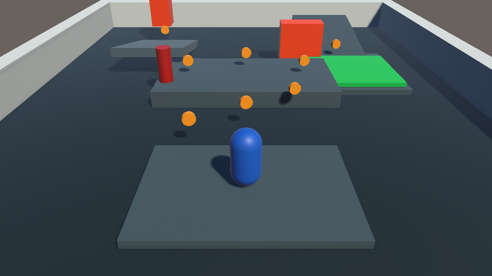

# Задача 5. Игровой прототип в Unity

Задача оформлена как готовый проект **Unity 6.6.3f1** на Universal Render Pipeline. Создавать сцену или вручную назначать компоненты не требуется.

## Запуск

1. Откройте Unity Hub.
2. Добавьте проект из папки `UnityProject`.
3. Откройте сцену `Assets/Scenes/PracticeScene.unity`.
4. Нажмите **Play**.

Управление: `WASD` или стрелки — движение, `Space` — прыжок.

## Реализовано

- управляемый персонаж с системой здоровья;
- камера Cinemachine 3, плавно следующая за игроком;
- восемь вращающихся монет и экранный счётчик;
- бонусная зона с переключением анимации игрока;
- две физические взрывающиеся бочки с радиусным уроном и эффектом частиц;
- два циклически движущихся препятствия с контактным уроном;
- частицы движения персонажа;
- интерфейс с количеством монет, здоровьем и подсказкой управления;
- готовое окружение, материалы, освещение, префаб взрыва и настройки сборки.

## Основные файлы

- `UnityProject/Assets/Scenes/PracticeScene.unity` — готовая игровая сцена;
- `UnityProject/Assets/Scripts` — игровые компоненты;
- `UnityProject/Assets/Editor/PracticeSceneBuilder.cs` — воспроизводимый сборщик и валидатор сцены;
- `UnityProject/Assets/Prefabs/ExplosionEffect.prefab` — эффект взрыва;
- `UnityProject/Assets/Animations` — контроллер и клипы бонусной анимации;
- `UnityProject/Packages/manifest.json` — зависимости, включая Cinemachine 3.1.5.

## Проверка

Проект проверен в Unity 6.6.3f1:

- сцена проходит встроенную структурную валидацию;
- Play Mode запускается без ошибок и предупреждений;
- изменение здоровья и счётчика монет проверено во время выполнения;
- Windows-сборка `StandaloneWindows64` завершена успешно, без ошибок.

Служебные папки `Library`, `Temp`, `Logs`, `obj` и `UserSettings` исключены через корневой `.gitignore` и не должны загружаться в GitHub.

